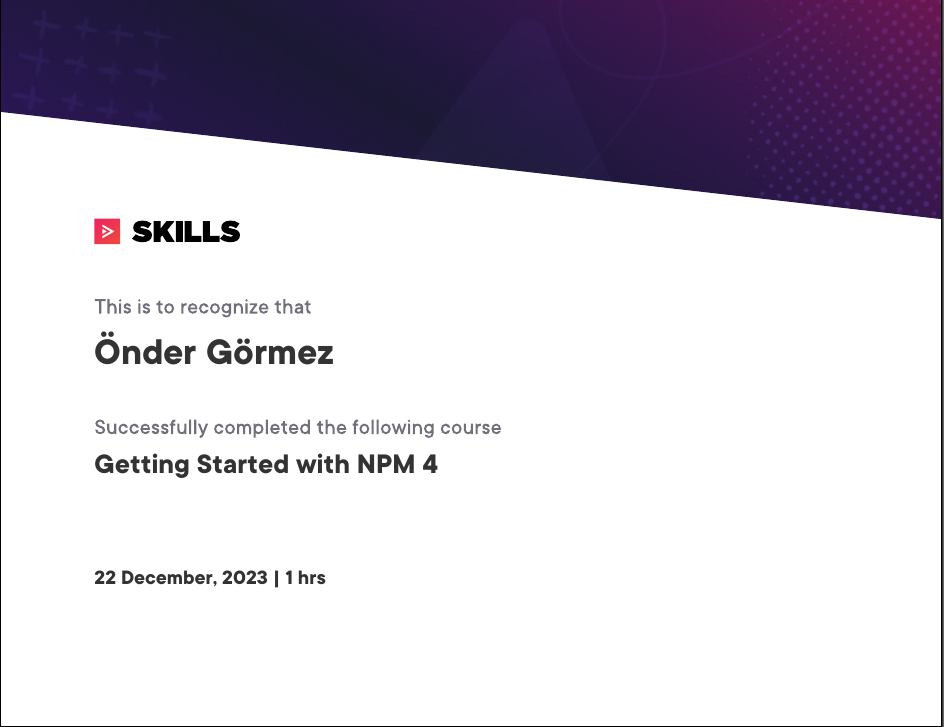

# Javascript Playground


## Courses
- [x] [Course 01: Getting Started with NPM 4](01-GettingStartedWithNPM4/readme.md)

## Used Tools

```sh
# Gets node repository
onder@Onder-Dell-G15-5520:~/$ curl -fsSL https://deb.nodesource.com/setup_18.x | sudo -E bash -

# The info appaer after commmand above
## Run `sudo apt-get install -y nodejs` to install Node.js 18.x and npm

## You may also need development tools to build native addons:
     sudo apt-get install gcc g++ make
## To install the Yarn package manager, run:
     curl -sL https://dl.yarnpkg.com/debian/pubkey.gpg | gpg --dearmor | sudo tee /usr/share/keyrings/yarnkey.gpg >/dev/null
     echo "deb [signed-by=/usr/share/keyrings/yarnkey.gpg] https://dl.yarnpkg.com/debian stable main" | sudo tee /etc/apt/sources.list.d/yarn.list
     sudo apt-get update && sudo apt-get install yarn

# We just run command below
onder@Onder-Dell-G15-5520:~/$ sudo apt-get install -y nodejs

onder@Onder-Dell-G15-5520:~/$ node -v
# v18.15.0
onder@Onder-Dell-G15-5520:~/$ npm -v
# 9.2.0
```

## Certificates

### Course 01: Getting Started with NPM 4


